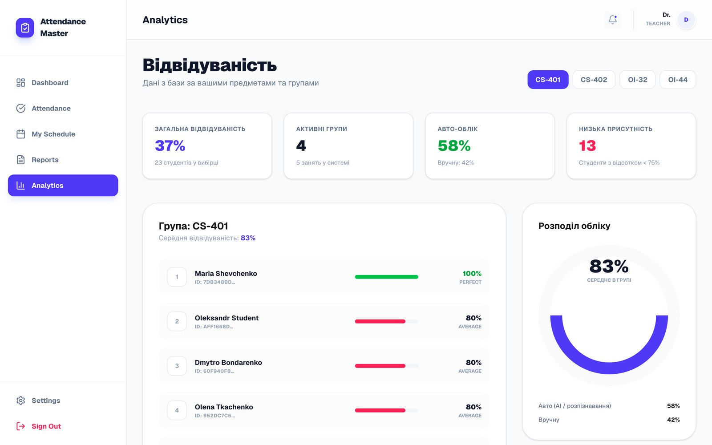
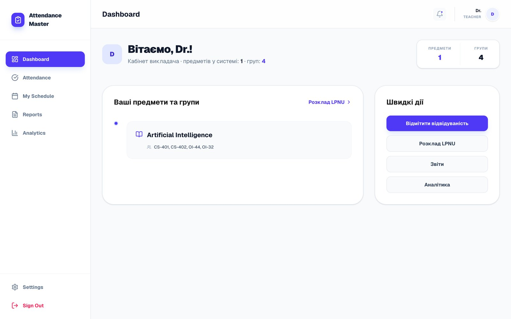
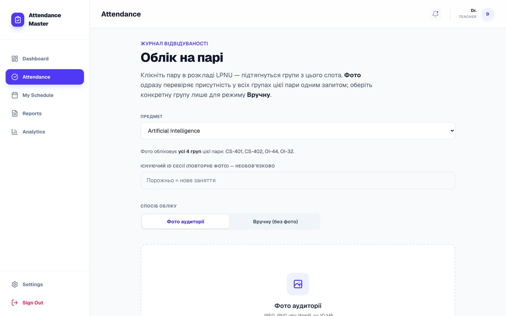
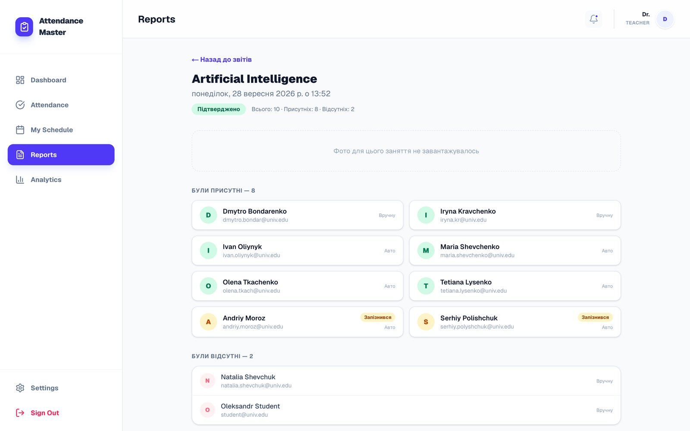
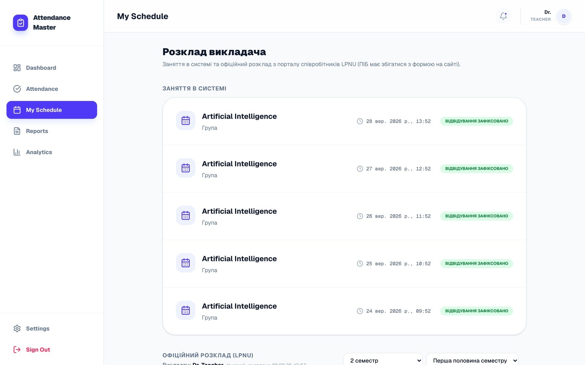
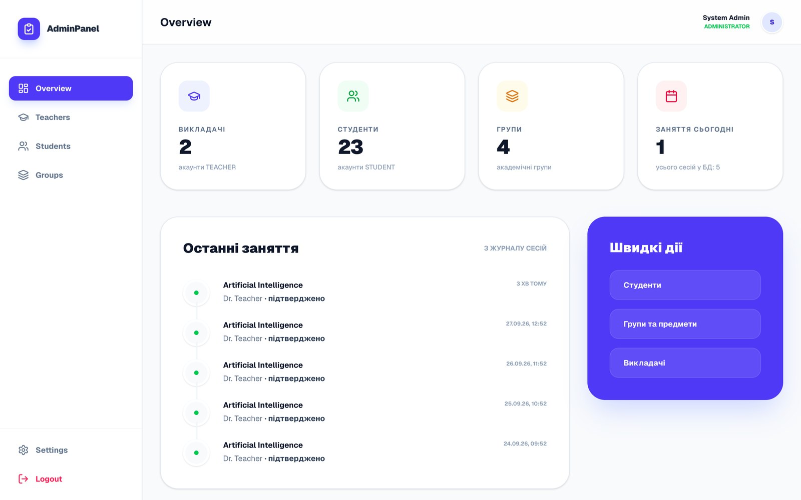
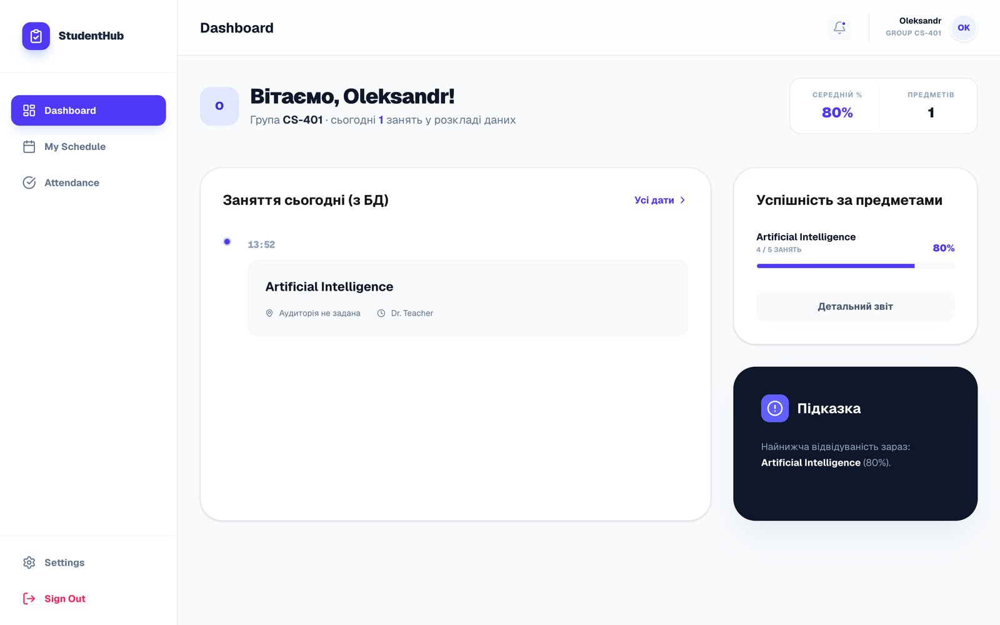
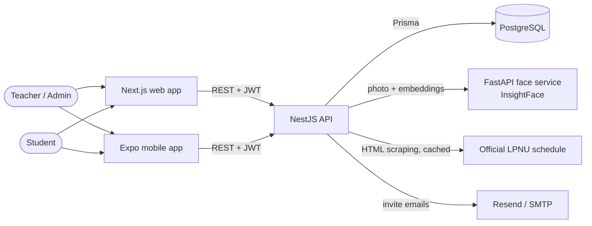
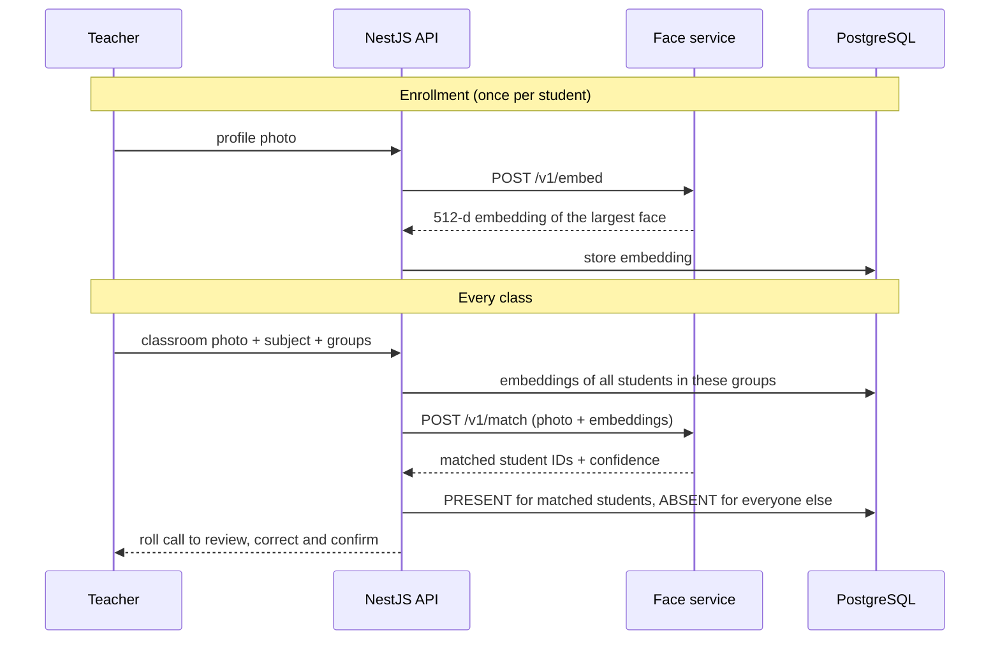
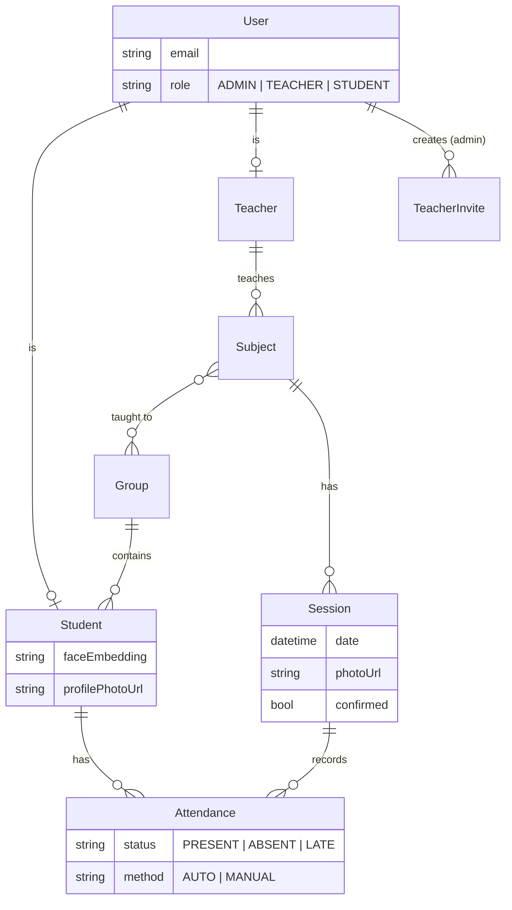

<div align="center">

# AttendanceMaster

**Automated student attendance tracking with face recognition.**<br>
The teacher takes one photo of the classroom, and the system finds every face, identifies the students and fills in the attendance record.


Bachelor's thesis · Lviv Polytechnic National University · Department of Automated Control Systems · 2026



</div>

## The problem

A manual roll call in a group of 25–30 students takes **5–15 minutes of every lecture**. Paper registers get lost or edited after the fact. RFID cards and QR codes need extra hardware and are easy to cheat, because a friend can scan your code for you.

AttendanceMaster replaces all of this with a single photo of the audience. It needs no special hardware, only a phone or a laptop, and one class takes **about 1–1.5 minutes** instead of 5–15.

## Features

**👩‍🏫 Teacher**
- Upload a classroom photo, and the students on it are marked as present automatically. One photo can cover several groups that share a lecture.
- Review the result and correct it by hand (present, late or absent), then **confirm** the session, which locks it.
- Browse reports for each session and see analytics by group: attendance rate, students at risk, and the share of automatic vs manual records.
- See their own timetable, pulled live from the **official Lviv Polytechnic schedule**. The groups for a subject can be synced from that schedule in one click.

**🎓 Student**
- Self-registration with one selfie, which becomes the face reference.
- A dashboard with today's classes, attendance per subject and the full history.
- The group's official university timetable.

**🛠 Admin**
- Manage groups, subjects and students.
- Invite teachers by email with a one-time link. Without a mail server configured, the link is returned so it can be forwarded manually.
- Organisation-wide statistics and a recent-activity feed.

**📱 Mobile app** (Expo): the same flows for teachers and students, plus taking the classroom photo directly with the phone camera.

## Screenshots

| Teacher dashboard | Taking attendance |
|---|---|
|  |  |
| **Session report** | **Teacher schedule (synced with LPNU)** |
|  |  |
| **Admin overview** | **Student dashboard** |
|  |  |

<sub>All names in the screenshots are generated demo data.</sub>

## How it works

### Architecture



| Service | Stack | Responsibility |
|---|---|---|
| [`backend/`](backend) | NestJS 11, Prisma 7, PostgreSQL, Passport JWT | REST API, roles, business logic, file uploads, schedule adapter |
| [`face-service/`](face-service) | Python, FastAPI, InsightFace, ONNX Runtime | Face detection, embeddings and matching |
| [`frontend/`](frontend) | Next.js 16 (App Router), React 19, Tailwind CSS 4 | Web app for admins, teachers and students |
| [`mobile/`](mobile) | Expo 54, React Native 0.81, React Navigation | iOS / Android app for teachers and students |
| [`nginx/`](nginx) | nginx | Reverse proxy in front of the API and face service |

### Face recognition pipeline



- **Model.** The service uses InsightFace `buffalo_l`: an SCRFD face detector plus an ArcFace ResNet-50 recognizer that produces L2-normalised 512-d embeddings. It runs on CPU through ONNX Runtime, so no GPU is needed.
- **Matching.** Every face in the photo is compared with every enrolled student of the selected groups using cosine similarity. The pairs are then assigned greedily from the highest score down, so **one face matches at most one student and one student at most one face**. Pairs below the threshold (`FACE_MATCH_THRESHOLD`, default `0.45`) are rejected.
- **Human in the loop.** Recognition only produces a draft. Every record stores its method (`AUTO` or `MANUAL`), the teacher can change any status, and after confirmation the session can no longer be edited.
- **Graceful fallback.** If the face service is unavailable, the API falls back to a mock recognizer and tells the user, so the rest of the app can still be developed and demoed.

### University schedule integration

The public Lviv Polytechnic timetables (`student.lpnu.ua` and `staff.lpnu.ua`) don't have an API. The backend scrapes the HTML with Cheerio, parses it into structured time slots and caches the result in PostgreSQL. The cache TTL is configurable from 1 minute to 6 hours and defaults to 4 hours. This is used for:

- showing students and teachers their real timetable;
- matching a class slot to the right subject and groups when attendance is taken;
- linking a subject to its groups from the official schedule in one click.

### Data model



## Getting started

### Prerequisites

- Node.js 20+
- Docker (for PostgreSQL and the face service)
- Optional: Expo Go on a phone, for the mobile app

### 1. Start the database and the face service

```bash
cp .env.example .env            # set POSTGRES_PASSWORD and JWT_SECRET
docker compose up -d postgres face-service
```

> The first start of the face service downloads the InsightFace model weights (~300 MB).

### 2. Backend

```bash
cd backend
cp .env.example .env            # use the same DB password as in the root .env,
                                # and uncomment FACE_SERVICE_URL
npm install
npx prisma migrate deploy
npx prisma db seed              # demo users, groups and attendance history
npm run start:dev               # http://localhost:3001
```

### 3. Web app

```bash
cd frontend
npm install
npm run dev                     # http://localhost:3000
```

### 4. Mobile app (optional)

```bash
cd mobile
cp .env.example .env            # EXPO_PUBLIC_API_URL = your computer's LAN IP, e.g. http://192.168.1.5:3001
npm install
npm start                       # scan the QR code with Expo Go
```

### Demo accounts (created by the seed)

| Role | Email | Password |
|---|---|---|
| Admin | `admin@univ.edu` | `Password123!` |
| Teacher | `teacher@univ.edu` | `Password123!` |
| Student | `student@univ.edu` | `Student123!` |

> Seeded students have no face data. For real matching, register a student with a selfie, or upload a profile photo for an existing student from the teacher's view, while the face service is running. That stores the student's embedding.

### Everything in Docker

`docker compose up -d --build` runs PostgreSQL, the face service, the API (it applies migrations on start) and nginx on port 80. The web and mobile apps still run with `npm` as shown above.

## Configuration

| Variable | Where | Description |
|---|---|---|
| `DATABASE_URL` | backend | PostgreSQL connection string |
| `JWT_SECRET` | backend | Secret for signing access tokens |
| `FACE_SERVICE_URL` | backend | URL of the face service. If it's not set, recognition runs in mock mode |
| `FACE_MATCH_THRESHOLD` | backend | Cosine similarity threshold, `0.45` by default |
| `FRONTEND_URL` | backend | Used to build teacher invite links |
| `RESEND_API_KEY` / `SMTP_*` / `MAIL_FROM` | backend | Email delivery for teacher invites (optional) |
| `LPNU_SCHEDULE_CACHE_TTL_SEC` | backend | How long a scraped schedule stays cached |
| `NEXT_PUBLIC_API_URL` | frontend | API URL, `http://localhost:3001` by default |
| `EXPO_PUBLIC_API_URL` | mobile | API URL reachable from the phone |

## API overview

<details>
<summary>Main REST endpoints</summary>

| Method | Endpoint | Role |
|---|---|---|
| `POST` | `/auth/login`, `/auth/register`, `/auth/register/student` | public |
| `GET` | `/auth/me` | any |
| `POST` | `/attendance/recognize` | teacher |
| `GET` | `/teacher/subjects`, `/teacher/subjects/:id/sessions` | teacher |
| `GET` / `PATCH` | `/teacher/sessions/:id/attendance` | teacher |
| `POST` | `/teacher/sessions/:id/confirm` | teacher |
| `POST` | `/teacher/subjects/:id/sync-groups-from-lpnu` | teacher |
| `POST` | `/teacher/students/:id/profile-photo` | teacher |
| `GET` | `/student/me`, `/student/schedule`, `/student/attendance` | student |
| `GET` / `POST` / `PATCH` / `DELETE` | `/admin/groups`, `/admin/subjects`, `/admin/teacher-invites` | admin |
| `GET` | `/analytics/teacher`, `/analytics/admin` | teacher / admin |
| `GET` | `/schedule/lpnu/student`, `/schedule/lpnu/lecturer` | any |

</details>

## Project structure

```
.
├── backend/          NestJS API: auth, admin, teacher, student, attendance,
│   │                 analytics, face client, LPNU schedule adapter, mail
│   └── prisma/       schema, migrations, demo seed
├── face-service/     FastAPI + InsightFace microservice
├── frontend/         Next.js web app (admin, faculty and student areas)
├── mobile/           Expo React Native app
├── nginx/            reverse proxy config
├── scripts/          bulk enrollment from a photo dataset, embedding regeneration
├── docs/             screenshots and the thesis defense presentation
└── docker-compose.yml
```

## Thesis

- **Topic:** Information system for automated student attendance tracking using computer vision technologies
- **Author:** Dmytro Zubyk, Computer Science (122)
- **Supervisor:** PhD, Assist. Petro Lyashchynskyi
- **University:** Lviv Polytechnic National University, Department of Automated Control Systems, 2026
- **Slides:** [defense presentation (.pptx)](docs/Zubyk_Defense_Presentation.pptx)

## License

© 2026 Dmytro Zubyk. All rights reserved. The code is published for portfolio and evaluation purposes only; see [LICENSE](LICENSE).
